# etcdee

A visual desktop console for managing etcd v3 clusters, built with Electron.
Browse and edit the keyspace, stream live changes, manage leases, and run the
administrative operations you'd otherwise reach for `etcdctl` to do — snapshots,
compaction, defragmentation, cluster health, alarms, and role-based access
control.

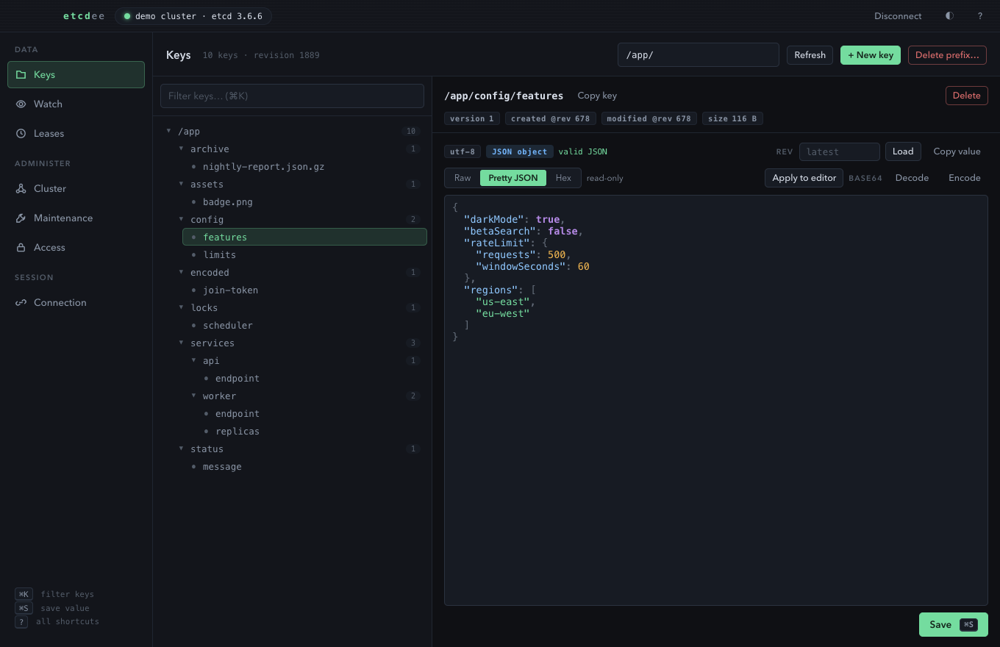

## Run it

```bash
npm install
npm start
```

Every screenshot below comes from a throwaway three-node
[kind](https://kind.sigs.k8s.io) cluster seeded with invented data — see
[Try it on a local cluster](#try-it-on-a-local-cluster) to reproduce it.

## Features

**Connection**
- Multiple saved connection profiles (multi-endpoint, username/password auth,
  TLS client certificates).
- Passwords are encrypted with the OS keychain (Electron `safeStorage`) when
  available.
- **Kubernetes port-forward mode**: point at a kubeconfig, pick a context,
  auto-discover etcd pods, and etcdee tunnels through the Kubernetes API
  server exactly like `kubectl port-forward` — no direct network path to the
  pod needed. See below.
- **In-cluster agent mode**: one click deploys a tiny broker pod into the
  cluster; etcdee then reaches *any* etcd address the cluster can route to —
  every member of a multi-member cluster, service DNS names, node IPs, even
  etcd VMs outside Kubernetes that the cluster network can see.

**Keys**
- Hierarchical tree of the keyspace (split on `/`) with keyboard navigation
  (arrow keys, Enter), filtering, and per-folder key counts.
- Full CRUD: create (optionally with a TTL lease), edit, save, delete, and
  guarded delete-by-prefix (type `DELETE` to confirm).
- Metadata for every key: version, create/mod revision, size, attached lease.
- Read a key at an older revision and restore it by saving.

**Value views** — etcdee sniffs each value and offers read-only renderings of
it. Switching view *never* touches the edit buffer, so formatting a value
costs nothing and leaves the key unmodified:

| View | Shown for |
| --- | --- |
| Raw | always — the editable source of truth |
| Pretty JSON | anything that parses as JSON |
| Kubernetes | `k8s\0` protobuf: apiVersion, kind, and a named field tree |
| Decompressed | gzip values (decompressed, then pretty-printed if JSON) |
| Base64 decoded | values whose text is valid base64 |
| Image | PNG / JPEG / GIF, rendered inline |
| Hex | always — offset, hex, and ASCII gutter |

The most readable view opens automatically, so a Kubernetes object shows as
`kind: Namespace` with named metadata and ISO timestamps instead of base64.
PDF, ZIP, SQLite, bzip2 and xz values are labelled by type.

Kubernetes stores its objects as protobuf, which etcd holds as opaque bytes.
etcdee parses the `k8s\0` envelope and walks the payload, resolving
`ObjectMeta` field names and `{seconds, nanos}` timestamps:

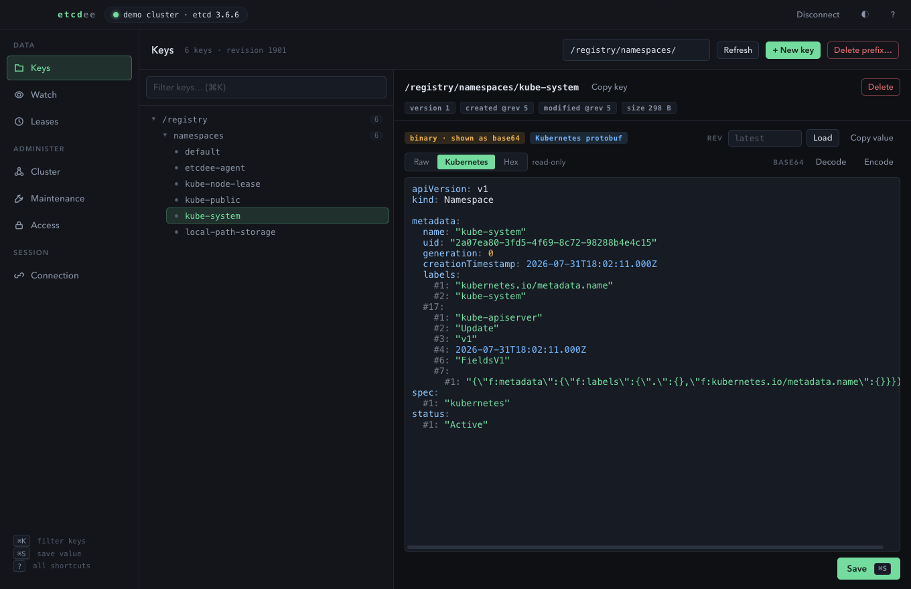

Compressed values are decompressed and then pretty-printed if what comes out
is JSON, and images are rendered inline:

| | |
| --- | --- |
| 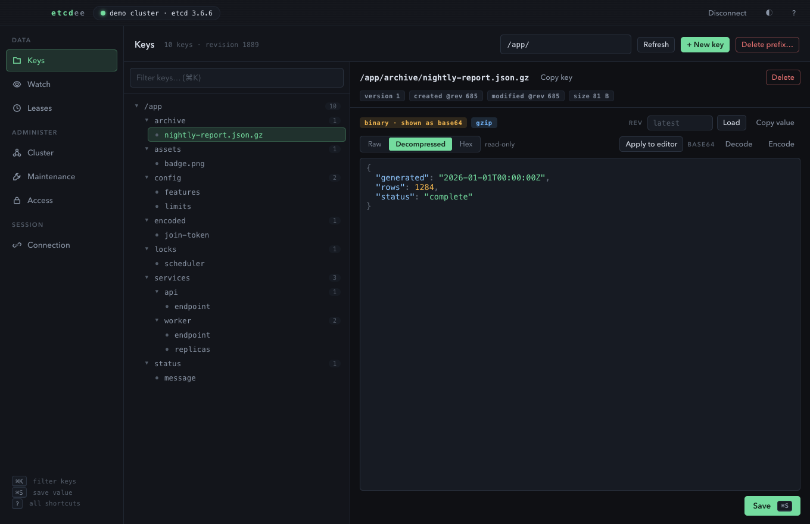 | 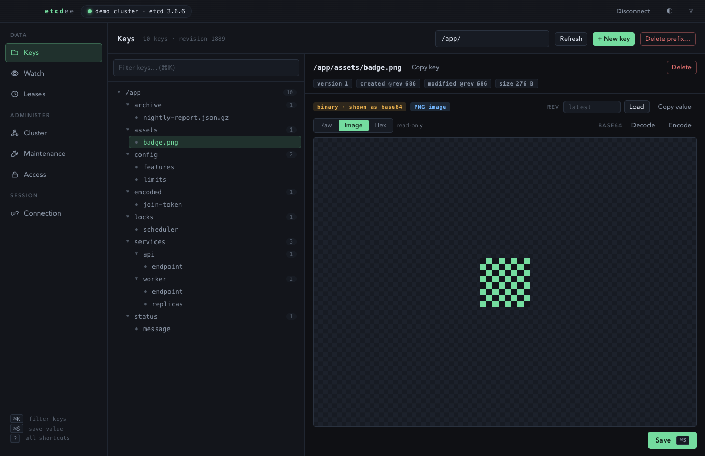 |

Rendered views are syntax highlighted — keys, strings, numbers, literals,
timestamps and byte offsets each get their own colour, in both themes.
Highlighting is tokenizer-driven and lossless (the painted text always
equals the source), and is skipped above 300 KiB where it would cost more
than it helps.

Two buttons do change the value, and say so: **Apply to editor** turns the
current rendering into a real edit, and **Decode/Encode base64** transform
the buffer inline. Both mark the key dirty and need an explicit save — so
inspecting a base64 value costs nothing, while rewriting it is deliberate.

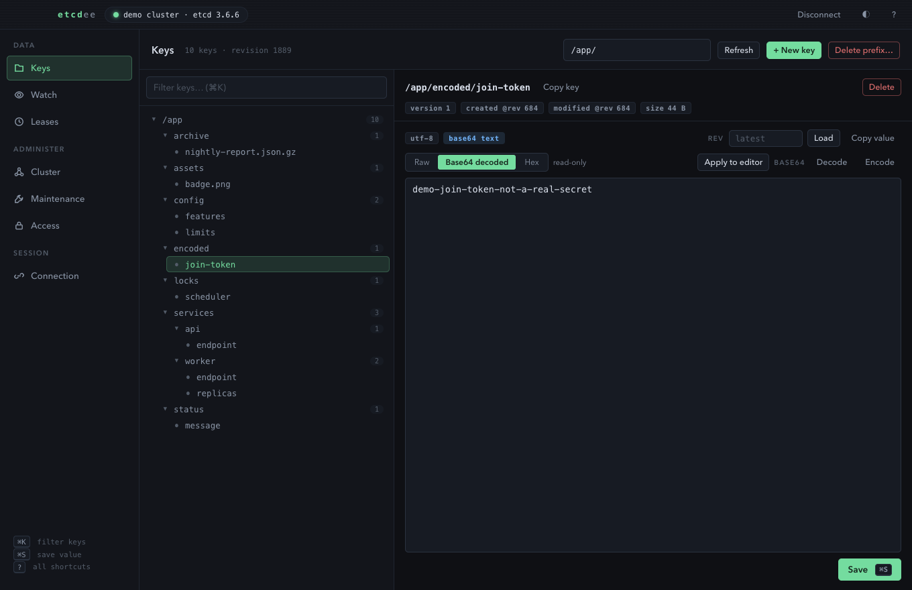

**Watch** — live event feed for any key or prefix, showing the previous value
alongside the new one on updates, and what was removed on deletes.

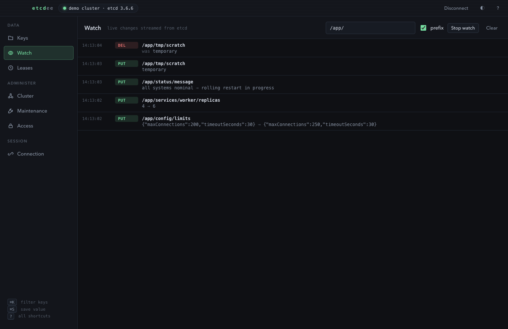

**Leases** — grant, inspect (TTL remaining, attached keys), and revoke. A
lease holding thousands of keys (Kubernetes attaches every event to one) is
summarised rather than allowed to bury the table.

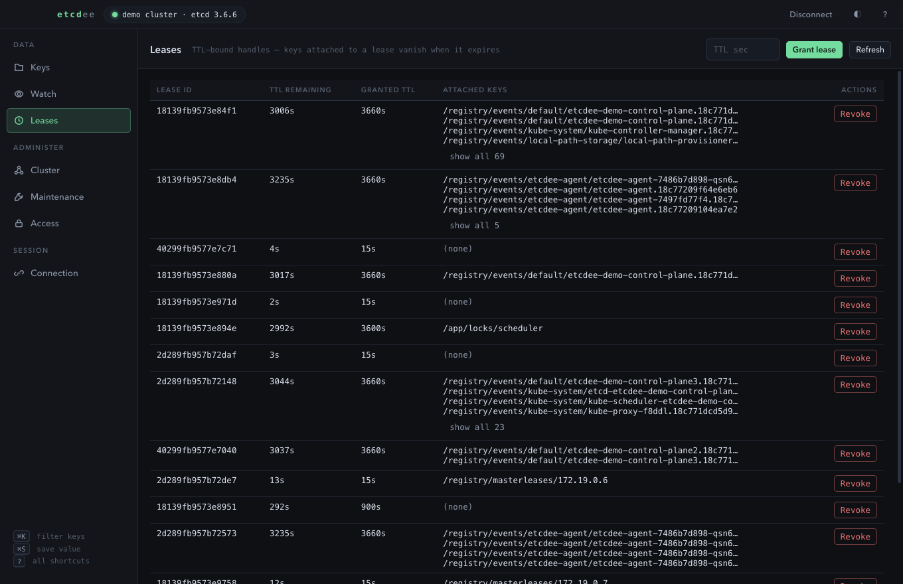

**Cluster** — member list with per-member status (version, DB size, raft term),
leader badge, leadership transfer, alarm listing and disarm.

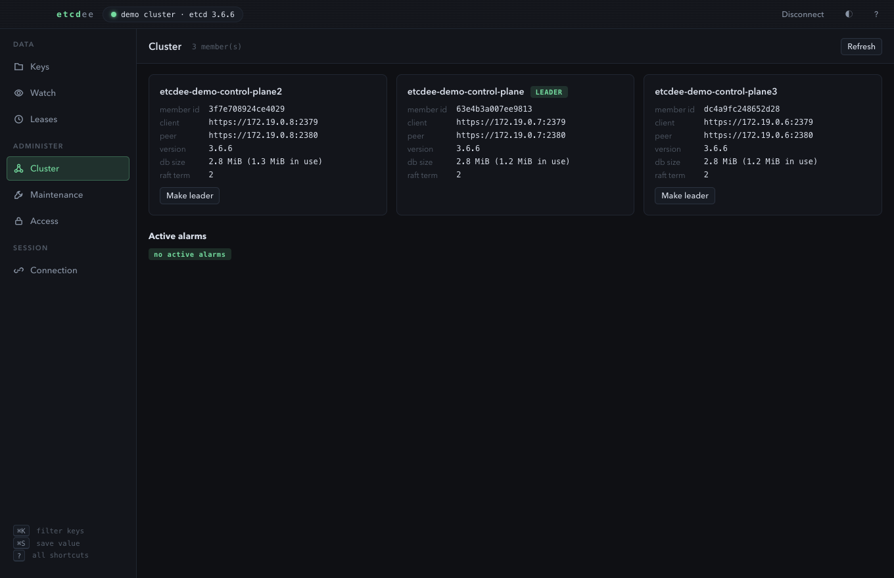

**Maintenance** — status dashboard (DB size, revision, raft term), streaming
snapshot save to a `.db` file, compaction to any revision, defragmentation.
Every destructive action gets a plain-language confirmation dialog.

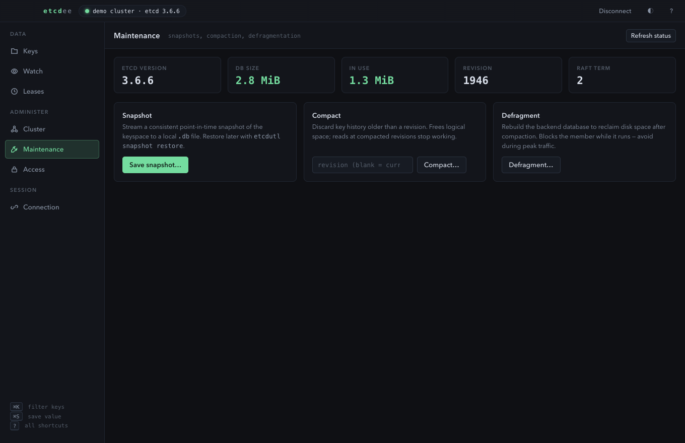

**Access** — manage etcd users and roles: create/delete, grant/revoke roles,
grant/revoke key and prefix permissions.

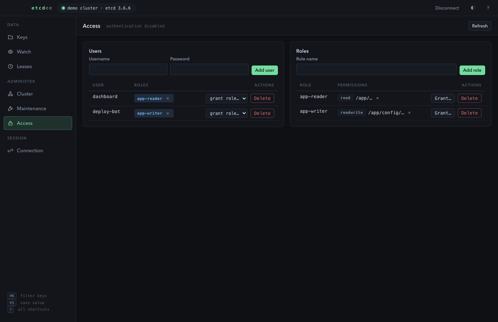

## Connecting through Kubernetes

On the Connection screen, enable **Connect through Kubernetes**, choose a
kubeconfig (defaults to `~/.kube/config`), load contexts, then **Find etcd
pods** — pods are matched by their labels (`component=etcd`, `app=etcd`,
`app.kubernetes.io/name`) or by having a container named `etcd` / running an
etcd image. Connections are tunnelled through the Kubernetes API server, so
it works anywhere `kubectl port-forward` would.

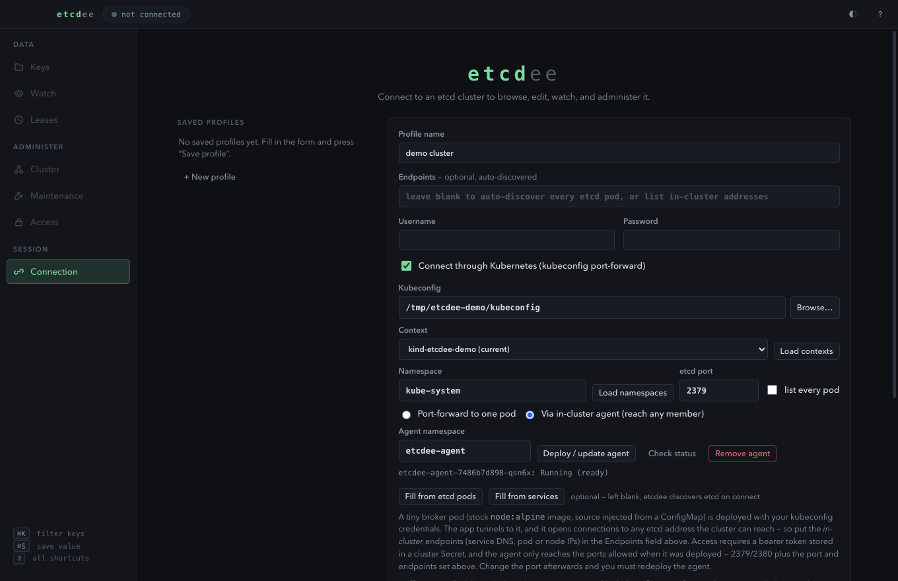

### etcd outside the control plane

Discovery is not limited to the core Kubernetes etcd. Leave **Namespace**
blank to scan the whole cluster, or set it to reach an etcd that belongs to
an application — a Helm chart, an operator, a database backing store. The
field is free text with a datalist, so **Load namespaces** is a convenience,
not a requirement: type the name directly when your account may not list
namespaces cluster-wide.

If a deployment follows no etcd naming convention at all, tick **list every
pod** to choose from every pod in the namespace; entries that don't look
like etcd are labelled rather than hidden. In agent mode, **Fill from
services** uses service DNS names (`name.namespace.svc:2379`) instead of pod
IPs, which survive pod restarts — the better choice for an app-level etcd
fronted by a Service.

**An application's etcd rarely uses the control-plane certificates.** If
*Fetch certs from cluster* loaded the OpenShift `etcd-client` secret, those
are for the control-plane etcd and a separate etcd will refuse them — untick
TLS if it serves plaintext, or point at its own certificates. When the agent
reaches the address but etcd never answers, etcdee says so explicitly rather
than blaming the address.

Portworx's internal **kvdb** is recognised (its pods are placeholders labelled
`kvdb`, with the real etcd on the host). Its service publishes 9019 but the
members listen on 17016, so etcdee uses the service address — a pod IP on the
published port answers nothing. Set **etcd port** to 9019 and leave TLS off.

In agent mode the Cluster view probes members by their advertised client URL,
then falls back to the IPs of the discovered etcd pods, identifying who
answered by the member id in the reply. That matters when members advertise
names only they can resolve — Portworx kvdb advertises `*.internal.kvdb`,
which no ordinary pod can look up. Probes run concurrently, so an
unresolvable address costs one timeout rather than one per member. Note the
agent must be allowed to reach the port members actually listen on (17016 for
kvdb, not the published 9019); redeploying the agent adds service target
ports automatically.

Notes:
- The kubeconfig user needs permission to list pods and create
  `pods/portforward` in the pod's namespace.
- **Control-plane etcd (kubeadm, kind)** requires etcd's client TLS
  certificates. On the control-plane node:
  `/etc/kubernetes/pki/etcd/ca.crt` and
  `/etc/kubernetes/pki/apiserver-etcd-client.{crt,key}` — for kind, extract
  them with `docker cp <node>:<path> .`. Tick *Use TLS client certificates*
  and point at those three files.
- **OpenShift** keeps equivalent certs in secrets in the `openshift-etcd`
  namespace (e.g. `oc extract secret/etcd-client -n openshift-etcd`).
- App-level etcd deployments without client-cert auth connect with no TLS
  config at all.
### When etcd is not on port 2379

Set **etcd port** on the connection form; it applies to both Kubernetes
modes and drives pod tunnelling, endpoint discovery and service matching.
The pod dropdown lists the ports each pod declares, but those are only a
hint — control-plane pods often declare just their metrics port (2381)
while still serving clients on 2379, so etcdee never infers the port from
them.

The in-cluster agent enforces an allowlist, refusing any port it was not
deployed with. **Deploy / update agent** builds that list automatically
from 2379/2380 plus the configured port and any ports in the Endpoints
field, and reports it (`ports 2379,2380,12379`). If you change the port
afterwards, redeploy the agent — connecting first gives an immediate error
naming the port and the fix rather than a timeout.

### In-cluster agent mode

Port-forward mode reaches exactly one pod. For everything else there is the
**agent**: on the Connection screen choose *Via in-cluster agent* and press
*Deploy / update agent*. Using only your kubeconfig credentials, etcdee
creates in the `etcdee-agent` namespace (configurable):

- a **Secret** holding a freshly generated bearer token,
- a **ConfigMap** containing the agent source ([agent/agent.js](agent/agent.js) —
  ~70 lines of dependency-free Node),
- a **Deployment** running it on a stock `node:22-alpine` image.

No custom image, nothing to push to a registry. The app port-forwards to the
agent pod and issues authenticated HTTP `CONNECT` requests; the agent opens
TCP connections to the requested etcd addresses on the cluster network. Put
the *in-cluster* endpoints (service DNS, pod/node IPs) in the Endpoints
field — comma-separate several for a multi-endpoint client.

Security posture: every tunnel request must present the bearer token from
the Secret (the app reads it via your kubeconfig), the agent only connects
to etcd ports (2379/2380 by default), and reaching the agent at all requires
`pods/portforward` RBAC. *Remove agent* deletes everything it created.

Extra benefit: in agent mode the Cluster view probes **every** member's
status through the agent (version, DB size, leader) — in port-forward mode
only the tunnelled member can be probed.

## Try it on a local cluster

A disposable [kind](https://kind.sigs.k8s.io) cluster is the quickest way to
see everything above, and it is what produced these screenshots. Three
control-plane nodes give a three-member etcd:

```bash
cat <<'YAML' | kind create cluster --name etcdee-demo --kubeconfig /tmp/etcdee-demo/kubeconfig --config -
kind: Cluster
apiVersion: kind.x-k8s.io/v1alpha4
nodes:
  - role: control-plane
  - role: control-plane
  - role: control-plane
YAML
```

kind keeps etcd's certificates on the node rather than in the API, so copy
them out:

```bash
docker cp etcdee-demo-control-plane:/etc/kubernetes/pki/etcd/ca.crt /tmp/etcdee-demo/certs/ca.crt
```

Repeat for `apiserver-etcd-client.crt` and `apiserver-etcd-client.key`, then
in etcdee: tick **Connect through Kubernetes**, point at
`/tmp/etcdee-demo/kubeconfig`, choose the `kind-etcdee-demo` context, select
**Via in-cluster agent**, press **Deploy / update agent**, tick **Use TLS
client certificates** with the three files, and connect with Endpoints left
blank. Delete it all afterwards with:

```bash
kind delete cluster --name etcdee-demo
```

## Accessibility & UX

- Full keyboard support: `⌘1–⌘7` switch views, `⌘K` filter, `⌘N` new key,
  `⌘S` save, `⌘R` refresh, `?` shows the shortcut reference.
- ARIA roles throughout (tree, dialogs, live regions for toasts and the watch
  feed), roving tabindex in the key tree, visible focus rings.
- Light and dark themes (follows the system, toggleable), `prefers-reduced-motion`
  respected.

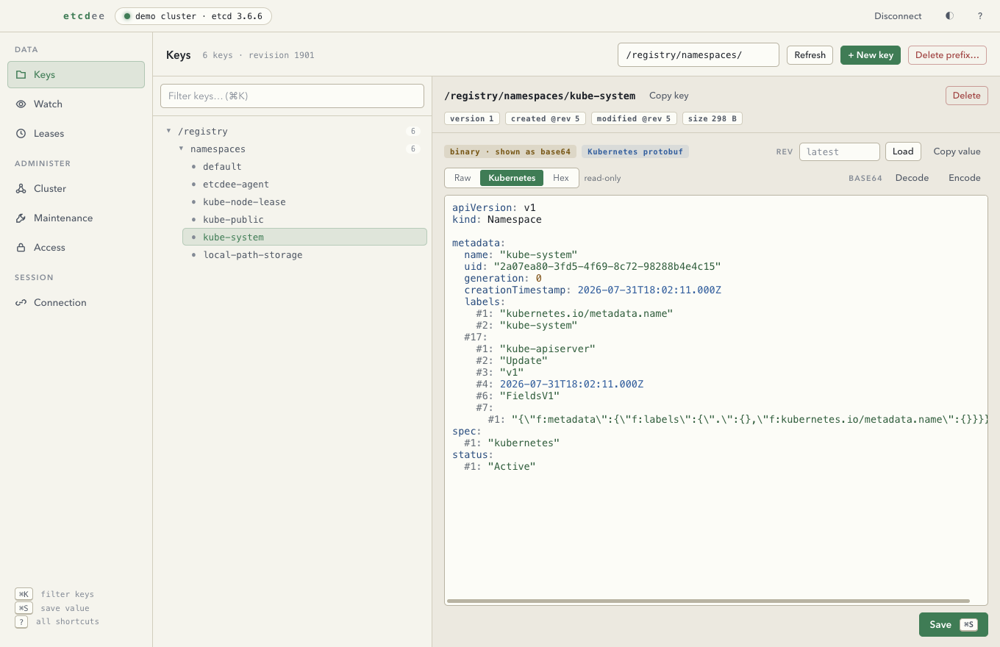

## Architecture

```
main.js            Electron main process: window, IPC, dialogs, profile storage
preload.js         contextBridge — the renderer only sees a typed async API
lib/etcd-service.js  All etcd3 (gRPC) calls; returns JSON-safe objects
lib/kube-bridge.js   kubeconfig parsing, etcd pod discovery, a local TCP
                     listener tunnelled via the Kubernetes port-forward API,
                     and the AgentTunnel that multiplexes CONNECT streams
lib/agent-manager.js deploys/removes the in-cluster agent via the K8s API
agent/agent.js       the agent itself: authenticated CONNECT proxy, no deps
renderer/          index.html + styles.css + app.js (no framework, no bundler)
renderer/codecs.js   value sniffing and read-only renderings (JSON, protobuf,
                     Kubernetes, gzip, base64, hex) — pure, no side effects
test/smoke.js      End-to-end service test against a real etcd (npm run smoke)
```

The renderer runs sandboxed with context isolation and no Node integration;
every etcd operation crosses IPC to the main process.

## Testing

With any etcd reachable at `http://127.0.0.1:2379` (or set `ETCD_ENDPOINT`):

```bash
npm run smoke
```

Exercises connect, CRUD, binary values, watch, leases, historical reads,
cluster status, alarms, compact, defrag, snapshot, and the auth lifecycle.

For the Kubernetes path, `npm run smoke:kube` discovers an etcd pod via a
kubeconfig and round-trips data through the port-forward tunnel (see the
header of `test/kube-smoke.js` for configuration).
